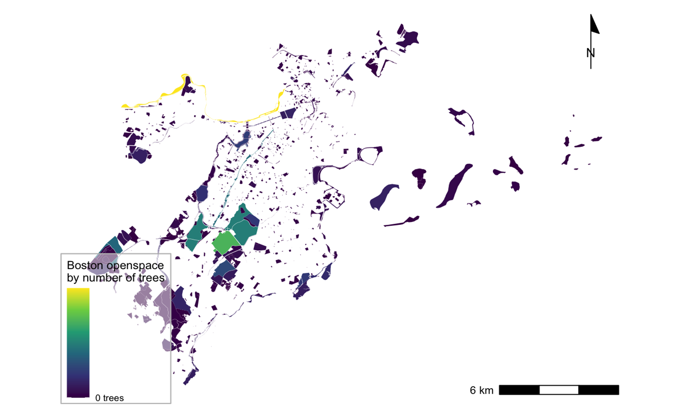
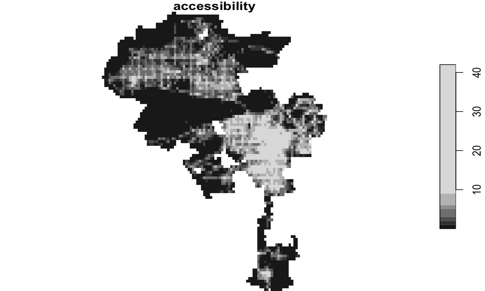
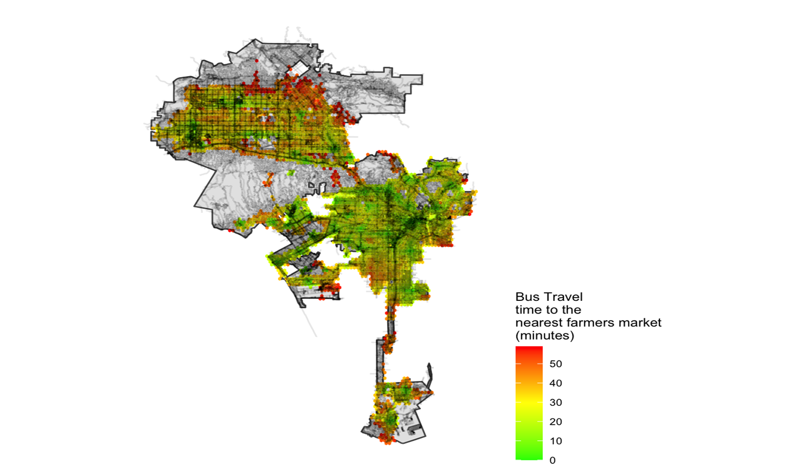
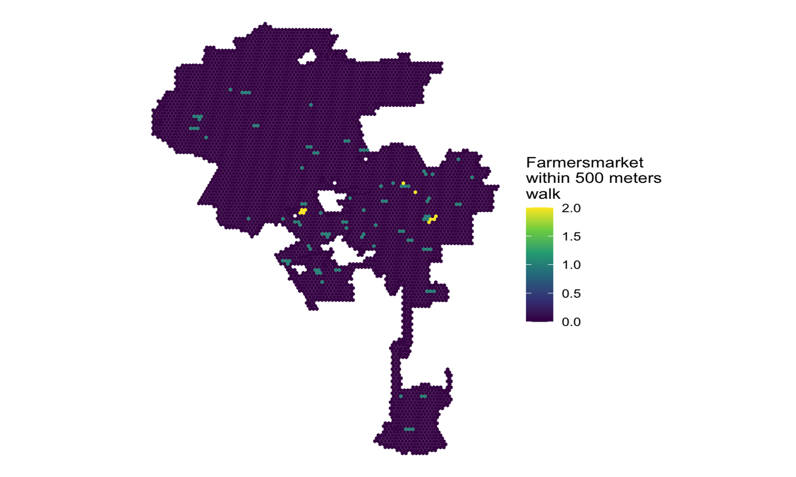
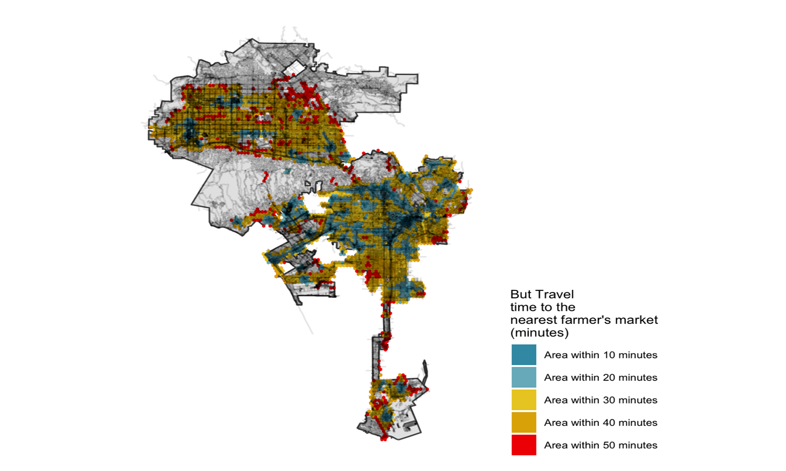

```{r setup, include=FALSE}
knitr::opts_chunk$set(echo = TRUE)
```

# Introduction

This is a portfolio that I have assembled to demonstrate the skills I have developed in VIS 2128 -- Spatial Analysis. I have created this page using RMarkdown. This portfolio highlights the skill I have developed in R Studio and ArcGIS Pro during Term 1 of the Fall Semester at Harvard's Graduate School of Design. These maps cover major metropolitan regions such as Boston, Chicago, and Los Angeles. 

My portfolio  demonstrates each of the following skills:

* Displaying multiple vector layers on the same map
* Calculating and displaying relationships among point and polygon layers based on distance
* Aggregating point data to a layer of polygons
* Calculating and displaying accessibility, based on travel time
* Converting between raster layers and vector layers
* Displaying raster data on a map
* Georeferencing a raster image
* Displaying data on an interactive map

# Map of Chicago
Here is a map of Chicago depicting the relationship between CTA L-Stops and Enterprise zones.

[](https://gbarrettjackson.github.io/spatialanalysis/fullsize/ctasptops.ezones.pdf){target="_blank"}

# Maps of Boston
Here are three maps of Boston. The first two maps illustrate the relationship between trees and community centers as well as trees and open space.The final Map is a georeferenced image created in ArcGIS Pro that shows a historic map of East Boston overlaid on the present East Boston.

These maps demonstrate the following skills:

* Aggregating point data to a later of polygons
* Calculating and displaying relationships among point and polygon layers based on distance
* Georeferencing a raster image

[](https://gbarrettjackson.github.io/spatialanalysis/fullsize/trees.commctrs.pdf){target="_blank"}

[](https://gbarrettjackson.github.io/spatialanalysis/fullsize/openspace.trees.pdf){target="_blank"}

[](https://gbarrettjackson.github.io/spatialanalysis/fullsize/GeoreferencedMap.pdf){target="_blank"}

# Maps of The City of Los Angeles and Los Angeles County

## Interactive Map
This interactive map shows the percent of population identifying as Black alone in Los Angeles County. This visualization demonstrates the following skills: 

* Displaying data on an interactive map

[](https://gbarrettjackson.github.io/spatialanalysis/fullsize/LA_County_Transit_Commute.html){target="_blank"}

## Accessibility
This map shows accessibility based on a distance-decay function of the walking time to the nearest transit stop. It demonstrates the following skills:

* Displaying multiple vector layers on the same map
* Calculating and displaying accessibility, based on travel time
* Displaying raster data on a map

[](https://gbarrettjackson.github.io/spatialanalysis/fullsize/accessibilityscore.pdf){target="_blank"}

[](https://gbarrettjackson.github.io/spatialanalysis/fullsize/raster.accessibility.pdf){target="_blank"}

[](https://gbarrettjackson.github.io/spatialanalysis/fullsize/contour.accessibility.pdf){target="_blank"}

## Travel
These maps show bus travel to the nearest farmers market, bus stops within a 500 meter walk, and farmers markets within a 500 meter walk. 

[](https://gbarrettjackson.github.io/spatialanalysis/fullsize/bus.lamarket.pdf){target="_blank"}

[](https://gbarrettjackson.github.io/spatialanalysis/fullsize/bus.stops.500walk.pdf){target="_blank"}

[](https://gbarrettjackson.github.io/spatialanalysis/fullsize/lamarket.500.walk.pdf){target="_blank"}

## Isochrones
This map show isochrones based on transit travel times to the nearest farmers market. It demonstrates the following skills:

* Displaying multiple vector layers on the same map
* Calculating and displaying accessibility, based on travel time

[](https://gbarrettjackson.github.io/spatialanalysis/fullsize/bus.lamarket.isochrones.pdf){target="_blank"}


